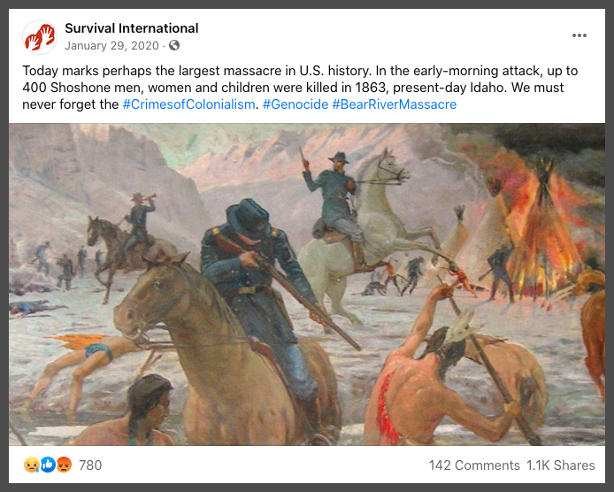
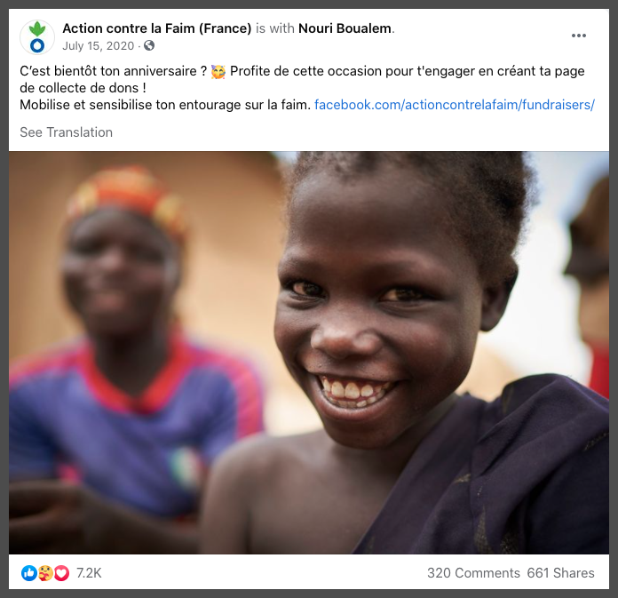

```{r setup, include=FALSE, warning=FALSE}
library(knitr)
library(kableExtra)
library(tidyverse)
library(lubridate)
library(scales)
library(formattable)
library(shiny)
library(reactable)
library(DT)
library(viridis)
library(hrbrthemes)
library(plotly)
library(renv)
knitr::opts_chunk$set(echo = TRUE)
renv::init()
```

## Acknowledgements 
 
We wish to thank our reviewers for their helpful comments and suggestions in the production of this first ACSIA NGO Community Report. We wish to thank the students from the American Graduate School in Paris NGO Course who helped identify the NGOs operating in Paris, France.

## What is a nonprofit sector report?

What does the NGO community look like in Paris? Beginning in August 2020, we set out to answer that seemingly simple question using a novel quantitative approach that combines privileged access to Facebook servers with social network analysis to map the nonprofit community across Paris.^[Data from CrowdTangle, a public insights tool owned and operated by Facebook.] What follows is the first publication of its kind. We build upon early social science research and classification strategies to bridge the information gap between theory and practice.  Our results provide new opportunities to unpack the dense layers of nonprofit networks operating across Paris, Europe, and internationally using state-of-the-art tools and methods. But it's more than that—we demonstrate how our results can be extrapolated to learn features about other communities, regardless of location or interest. We utilize standardized OECD taxonomies that are tailored to the NGO sector and a common lexicon to describe key features in the data.

So how can you use this report? Our intent is to provide more than an understanding about the grassroots NGO community within Paris. In section three, we provide valuable insights about the usage of social media content. As a small NGO with limited resources perhaps you are interested in Facebook ad-buys. What type of content is most engaging? What day of the week should I time my ads? What are other nonprofits doing in my particular sector? Each are important questions to ask as you look to increase the reach of your work with a wider audience. 

Perhaps you are more interested in learning about emerging themes that are spurring greater civic participation and activism? In the educational sector, you will see evidence of the growing importance of identity in French society. In the health sector, we can observe the impact of the COVID-19 pandemic and its growing significance at the intersection of Global Health and International Relations. What role are religious organizations serving in the delivery of humanitarian aid abroad? All relevant questions that provide puzzles for future research. 

In the years ahead, we will expand our NGO sector report to include other locations, beginning with New York City in 2021. Our intent is to map NGO communities on both sides of the Atlantic to identify key actors, their relationships, and most importantly—future opportunities for collaboration. In 2021, global challenges are myriad and require collective action to address the greatest threats to humanity including climate change, human rights, political corruption, health and poverty. At ACSIA, we believe that a strong, independent and diverse NGO sector is an essential component of a healthy, functioning society. Our mission is to create globally empowered communities of knowledge to make collaboration easier. This small report is a step in that direction.  

## Methodology 

### Sample space
The social system is defined as the nonprofit community within the Paris metropolitan area, *Île-de-France* region, and is limited to the twenty administrative districts or *arrondissements municipaux*. We capture all organizational levels of nonprofit organizations including local (Paris), state (France), regional (EU), and international NGOs, which provide a physical Paris address and postal code (75001 to 75020) between the time period of 01 January 2018 and 01 January 2021. 

We narrowly define nongovernmental organization (NGO) to those nonprofit organizations engaged in the public good. Although a full listing of all Paris-based NGOs is not possible, we drew a representative sample of the community including registered nonprofit organizations per the *Association loi de 1901* within France and maintain at least 300 verified Facebook followers. In total, the sample space contains more than 300  official Facebook Pages via CrowdTangle. Our goal in doing so was to track every “influential” account on Facebook that provides social media content to public followers, other nonprofits, and the wider Paris community. 

CrowdTangle data tracks public content only. For the purposes of this project we did not track public groups, Instagram, Reddit, or Twitter profiles. This is an area for exploration in future reports. Private Facebook and Instagram accounts, private Facebook groups and Facebook Personal Profiles were not tracked in the publication of this report. All public posts, metrics, and insights are available in the public domain. 


### Key Terms

**Nongovernmental Organization (NGO)**: is defined as a nonprofit and voluntary citizens’ organization organized at the local, national, regional or international level to address issues in support of the public good. For the purposes of this report, NGOs include those organizations that are officially associated within France under the L’association loi 1901.  

**NGO Sector**: NGO sectors are predefined categories that combine the OECD Development Assistance Committee (DAC) sector classifications and CRS purpose codes with InterAction NGO Aid Map approach to sector coding (e.g. environmental, health, education.) An NGO can be coded into multiple sectors depending upon its overall mission and programs. 

**Engagement**: Defined as reactions, comments, and shares to a Facebook public post. A user can react to a post with a like, angry, haha, wow, sad, love, or care emoji. Comments are instances where a Facebook user comments or replies to a public post. Shares are the forwarding of a public post by a Facebook user to their timeline, in groups, or friends. Interactions are also known as engagements.

**Total Interactions**: A summary statistic that identifies the total number of reactions, shares, and comments on a Facebook public post. 

**Interaction Rate**: For a single post, this statistic is calculated by dividing the total number of interactions (e.g., reactions, comments, and shares) by the account size (followers/Page likes). To find the average interaction rate for an NGO sector during the sample period, we sum the total number of interactions of all posts, divide by the number of total posts, and divide again by the average page likes for all NGOs categorized within the sector during the sample period. 

**Overperforming**: A metric used to assess how a current post is performing in terms of interactions compared to prior interactions on the last 100 posts. These “above average” posts may provide useful insights regarding what types of content and messages are most likely to resonate with a public audience. Likewise, underperforming posts are below average and calculated in the same way as overperformance. 

**Page Followers**: Users who choose to follow a Facebook Public page  (e.g., businesses, organizations, brands) may see updates in their News Feed. If users like a Page, they will automatically follow it. Users can also choose to unfollow the Page while keeping the like. It is not required to like a Page in order to follow it. 

### Nonprofit classification strategy

In order to promote shared understanding and future collaboration, we utilize standard taxonomies for categorizing more than 300 unique Facebook Pages according to their individual missions, programs, and objectives. We utilize a modified sector listing that combines OECD DAC sector codes with the methodology employed by the InterAction NGO Aid Map. 

Of note, some NGOs are placed into multiple categories depending upon the nature of their work. Not all categories were used in the production of this report. 

```{r echo=FALSE, warning=FALSE}
ngo_tbl <- data.frame(
 "NGO Sector" = c("Agriculture", "Animal Welfare", "Capacity Strengthening Organization (CSO)",
            "Communications/Technology", "Conflict Prevention and Resolution/Peace and Security",
            "Construction", "Debt Relief", "Disaster Prevention and Preparedness", 
            "Economic Recovery and Development", "Education", "Energy", "Environment", "Fishing",
            "Food Aid", "Forestry", "Gender", "Health", "Human Rights, Democracy, and Governance",
            "Humanitarian Aid", "Mining and Extractive Resources", "Other", "Protection", "Refugee
            Resettlement", "Shelter and Housing", "Social Services", "Trade", "Transport/Infrastructure",
            "Water Sanitation and Hygiene"),
 "Total NGOs Mapped" = c(
   "3", "1", "29", "16", "5", "2", "0", "4", "18", "82", 
   "0", "28", "1", "6", "1", "17", "35", "40", "11", "1", 
   "21", "18", "7", "1", "30", "1", "0", "4"),
 check.names = F
)

unit.scale = function(x) (x - min(x)) / (max(x) - min(x)) #unit.scale function

   formattable(ngo_tbl,
               align = c("l", "l"),
      list(`Indicator Name` = formattable::formatter("span", style = ~ style(color = "grey", font.weight = "bold")),
         `Total NGOs Mapped` = color_bar("#B1CBEB", fun = unit.scale))) %>%
   as.datatable(escape = FALSE, 
                options = list(dom = 't',
                               order = list(list(2, "desc"))
                               ))
   
```

Multiple data sources were consulted in attempting to capture a representative sample of the Paris NGO landscape. These included association legal filings and official French government records under the *Association loi de 1901*, the World Association of Non-Governmental Organizations (WANGO) Worldwide NGO Directory, and Devex.com. Additional contributions were captured by student volunteers at the American Graduate School in Paris. 

## Paris NGO Sectors {.tabset .tabset-pills}

 
### Environmental Sector

Total **Environmental** NGOs mapped:**28** Paris-based NGOs

During the sample period, the **Environmental** sector remained the NGO leader for social media within the greater Paris market. Although we observed reduce interaction rates during 2020-2021, we can observe consistent growth over the past five years. The **Human Rights, Democracy and Governance** sector eclipsed the **Environmental** sector's total interactions in 2017. Yet, the **Environmental** sector’s overall interaction rate was more than double that of the **Human Rights, Democracy and Governance** sector (**1.216%** compared to **0.552%**) This suggests that the environmental sector maintains a smaller but more engaged followers on its social media accounts.  


```{r, echo=FALSE, fig.cap="Figure 1: Environmental social media interaction trends, 2020-2021. Source: Facebook CrowdTangle", fig.align='center'}

```

During 2020, link sharing and photos accounted for approximately **69.52%** of total interactions on Facebook. With a monthly interaction rate of **0.85%**, the **Environmental** sector leads social media interactions across the greater Paris nonprofit sector. The greatest level of engagement took place between July and September 2020. As shown in Figure 2, we see the greatest growth in followers between March and May 2020 <span style="color: green;">(+83.5K; +3.84%)</span> and in September 2020 <span style="color: green;">(+30.5K; +1.22%)</span>. 

```{r, echo=FALSE, fig.cap="Figure 2: Environmental sector follower growth, 2020-2021. Source: Facebook CrowdTangle", fig.align='center'}

```


#### Environmental Sector Leaders

In terms of reach, the **World Wildlife Fund (WWF-France)** has the greatest reach within Paris (**899,401** page followers) despite a low interaction rate with the public relative to its page followers (**0.291%** interaction rate; **573,657** total interactions). Relative to its reach, **PETA France** (**117,628** page followers) is a leader in total interactions with a highly engaged audience (**1.25M** total interactions, **2.785%** interaction rate). The growth rates for both nonprofits are within the median range compared to other environmental nonprofits. **WWF-France** excels at the use of video to spread awareness about its core mission. 

```{r, echo=FALSE, fig.cap="Figure 3: Top **WWF-France** post of 2020 showed rare footage of a snow leopard with cubs garnering more than **834.6K** total views with **6,935** shares.", fig.align='center', out.height="50%", out.width="50%"}

```


**Greenpeace France** total interactions (**1.39M**) topped all other environmental sector pages during 2020 despite its relatively low interaction rate (**0.366%***) compared to other top performers. Notably, in February 2021, the Paris Administrative Court ruled in favor of plaintiffs, including Greenpeace France, in a landmark case acknowledging the responsibility of the French State for the climate crisis. Executive director of Greenpeace France Jean-François Julliard said in response: 

> “Let’s be frank: this is an historic win for climate justice. A French judge has ruled that climate inaction of the French State is illegal. This decision not only takes into consideration what scientists say and what people want from French public policies, but it should also inspire people all over the world to hold their governments accountable for climate change in their own courts.”

```{r, echo=FALSE, fig.cap="Figure 4: **Greenpeace** maximizes its viral reach through the use of 30-second video messages", fig.align='center', out.height="50%", out.width="50%"}

```


**PETA France** exhibited the highest interaction rates (**2.758%**) during 2020 suggestive of its core group of highly concentrated activists and supporters. 

```{r, echo=FALSE, fig.cap="Figure 5: **PETA France** most popular post in terms of total interactions during 2020 focused on the Egyptian Ministry of Tourism ban on dromedary and horseback rides at popular tourism sites.", fig.align='center', out.height="50%", out.width="50%"}

```

Anti-poaching nonprofit **Wildlife Angel** led sector growth overall for 2020 <span style="color: green;">(+28.50%; +6,132)</span> in terms of page followers. **Wildlife Angel** is a French-Burkinabé Non Profit Organization specialised in organizing natural and wildlife parks protection, especially in Africa.

```{r, echo=FALSE, fig.cap="Figure 6: A **Wildlife Angel** post from 2020 highlighted illegal forestry activities in Gambia and Senegal for the Chinese furniture market triggered more than **1.1K** unique shares on its Facebook Page.", fig.align='center', out.height="50%", out.width="50%"}

```

#### Environmental Sector Summary Features {.tabset .tabset-pills}

##### 2021 Environmental Sector Data

```{r echo=FALSE, warning=FALSE}
top_env_ngo <- data.frame(
   "NGO" = c("Greenpeace France", "PETA France", "WWF-France", "Wildlife Angel", "CCFD-Terre Solidaire"),
   'Total interactions' = c(1390000, 1250000, 573657, 130913, 78364),
   'Interaction rate' = percent(c(.00366, .02785, .00291, .01656, .00126)),
   'Avg. posts per day' = c(1.25, 1.1, 0.63, 0.88, 0.99),
   'Page followers' = c(869145, 117628, 899401, 27648, 174468),
   "Growth" = percent(c(.0983, .1246, .0956, .2850, .0289)),
   check.names = F)


formattable(top_env_ngo, align = c("l", "l", "c", "c", "l", "c"), 
            list(
               "NGO" = formatter("span", 
                                 style = ~ formattable::style(color = "grey",font.weight = "bold")), 
               "Total interactions" = color_bar("#B1CBEB"),
               "Interaction rate" = color_tile("#DeF7E9", "#71CA97"),
               "Avg. posts per day" = color_tile("#DeF7E9", "#71CA97"),
               "Page followers" = color_bar("#B1CBEB"),
               "Growth" = color_tile("#DeF7E9", "#71CA97")))
```


##### 2018-2020 Environmental Sector Comparison

```{r echo=FALSE, warning=FALSE}
env_compare <- data.frame(
   "Year" = ymd(c(20200101, 20190101, 20180101)),
   "Total interactions" = number(c(3660000, 4120000, 3950000), big.mark = ","),
   "Interaction rate" = percent(c(0.0804, .01116, .01293)),
   "Avg. posts per day" = c(13.63, 12.15, 11.83),
   "Page followers" = number(c(2550000, 2330000, 1980000), big.mark = ","),
   "Growth" = percent(c(.0918, .1784, .2323)),
   check.names = F
)

formattable(env_compare, align = c("l", "l", "c", "c", "l", "c"), 
            list(
    "Year" = formatter("span", style = ~ formattable::style(color = "grey",font.weight = "bold")),
     "Interaction rate" = color_tile("#DeF7E9", "#71CA97"),
     "Avg. posts per day" = color_tile("#DeF7E9", "#71CA97"),
     "Growth" = color_tile("#DeF7E9", "#71CA97")))
```


### Human Rights, Democracy, and Governance Sector 

**Human Rights, Democracy, and Governance** NGOs mapped: **40** Paris-based NGOs

Despite the **Environmental** sector leading overall interactions for 2020, the **Human Rights, Democracy and Governance** sector also exhibited a high degree of public interaction with more than **3.31M** interactions, page growth of <span style="color: green;">5.61% (+130,881)</span> from previous year and an average interaction rate of **0.39** percent. We can see evidence of high levels of public engagement on issues of police brutality, national security, identity and colonialism, and the regularization of undocumented migrants.


```{r, echo=FALSE, fig.cap="Figure 1: Human Rights, Democracy and Governance interaction trends, 2020-2021. Source: Facebook CrowdTangle", fig.align='center'}

```


As shown in figure 1, total interactions during 2020 approached approximately **3.31M** interactions with an average monthly interaction of **254.4K** or **0.44%**. Link sharing and photos dominated the majority of interactions with the the highest activity between April and June 2020. The use of Facebook videos are garnered a significant amount of attention with more than **693.3K** interactions. As shown in figure 2, follower growth increased during the spring 2020 with a significant uptick in September and October 2020. Both periods of increased activity occurred during the first and second COVID-19 waves within France. 

```{r, echo=FALSE, fig.cap="Figure 2: Human Rights, Democracy and Governance follower growth, 2020-2021. Source: Facebook CrowdTangle", fig.align='center'}

```


#### Human Rights, Democracy, and Governance Sector Leaders

**ATTAC France** *Association pour la Taxation des Transactions financières et pour l'Action Citoyenne* was categorized in the **Human Rights, Democracy, and Governance** sector despite its single issue focus on the establishment of a tax on foreign exchange transactions. Despite this single issue focus on asserting control over financial markets, it focused on the pursuance of anti-globalization policy and its inclusion within the category. 

```{r, echo=FALSE, fig.cap="Figure 3: The top **ATTAC France** shared post of 2020 highlighted the February 15, 2020 *#TousseEnPiste* protests at l'Aéroport de Chambéry.", fig.align='center', out.height="50%", out.width="50%"}

```

During the protests, **ATTAC France** participated with other environmental NGOs including **Les Amis de la Terre** and **Extinction Rébellion France** in criticizing French President Emmanuel Macron's *virage écologique* or ecological turn in policy. 

**Amnesty International France**

```{r, echo=FALSE, fig.cap="Figure 4: A five minute video shared by Amnesty International France in May 2020, which focused on police brutality in France received more than **2.41M** views and was shared more than **58K** times.", fig.align='center', out.height="50%", out.width="50%"}

```


**Ligue des droits de l’Homme**

```{r, echo=FALSE, fig.cap="Figure 5: The **Ligue des droits de l’Homme** press release in November 2020 called for the French government to respect United Nations recommendations and international law concerning a controversial French national security bill.", fig.align='center', out.height="50%", out.width="50%"}

```

**Survival International**

```{r, echo=FALSE, fig.cap="Figure 6: The top **Survival International** post of 2020 focused on the anniversary of the 1863 Bear River Massacre in Idaho. Although an international organization and focused on historical atrocities using the hashtag *#CrimesofColonialism* hints at the role of colonialism and atrocities in French history.", fig.align='center', out.height="50%", out.width="50%"}

```


**La Cimade**

```{r, echo=FALSE, fig.cap="Figure 7: A **La Cimade** video from June 2020 argued for the regularization of undocumented foreigners within France. It was viewed more than **69.5K** times on the **La Cimade** Facebook Page.", fig.align='center', out.height="50%", out.width="50%"}

```

#### Human Rights, Democracy and Governance Sector Features {.tabset .tabset-pills}

##### 2021 Human Rights, Democracy, and Governance Sector Data

```{r echo = FALSE, warning=FALSE}
top_hum_ngo <- data.frame(
   "NGO" = c("ATTAC France", "Amnesty International France", "Ligue des droits de l’Homme", 
                 "Survival International", "La Cimade"),
   `Total interactions` = c(1230000, 930742, 394572, 170334, 59025),
   `Interaction rate` = percent(c(.00793, .00379, .00116, .00038, .00387)),
   `Avg. posts per day` = c(3.08, 1.11, 6.31, 3.92, 0.52),
   `Page followers` = c(148876, 616159, 153958, 312339, 86134),
   `Growth` = percent(c(.1776, .0429, .0986, .0065, .1455)),
   check.names = F
)

formattable(top_hum_ngo, align = c("l", "l", "c", "c", "l", "c"), 
            list(
               "NGO" = formatter("span", style = ~ formattable::style(color = "grey",font.weight = "bold")), 
               "Total interactions" = color_bar("#B1CBEB", fun = unit.scale),
               "Interaction rate" = color_tile("#DeF7E9", "#71CA97"),
               "Avg. posts per day" = color_tile("#DeF7E9", "#71CA97"),
               "Page followers" = color_bar("#B1CBEB", fun = unit.scale),
               "Growth" = color_tile("#DeF7E9", "#71CA97")))
```


##### 2018-2020 Human Rights, Democracy, and Governance Sector Comparison

```{r echo = FALSE, warning=FALSE}
hum_compare <- data.frame(
   `Year` = ymd(c(20200101, 20190101, 20180101)),
   `Total interactions` = c(3270000, 2490000, 1970000),
  `Interaction rate` = percent(c(.0039, .00399, .00324)),
   `Avg. posts per day` = c(37.13, 29.39, 29.74),
   `Page followers` = c(2460000, 2330000, 2230000),
   `Growth` = percent(c(.0561, .0431, .0571)),
   check.names = F
)

formattable(hum_compare, align = c("l", "l", "c", "c", "l", "c"), 
            list(
    "Year" = formatter("span", style = ~ formattable::style(color = "grey",font.weight = "bold")),
     "Interaction rate" = color_tile("#DeF7E9", "#71CA97"),
     "Avg. posts per day" = color_tile("#DeF7E9", "#71CA97"),
     "Growth" = color_tile("#DeF7E9", "#71CA97")))
```


### Health Sector

Total number of **Health** sector NGO mapped: **35** Paris-based NGOs

The effects of the COVID-19 pandemic are apparent in the growth of interactions in the NGO Health Sector during 2020. Despite the average number of posts per day remaining relatively steady since 2018, we can observe a significant increase in the number of total interactions as well as interaction rate. The pandemic has affected each and every country, community and individual for over a year. We have seen a politicization of health that is unprecedented.  Preventing the spread of COVID challenged international institutions such as the European Union, particularly the Schengen Agreement, where the hallmark of the agreement is open borders and freedom of movement of goods and people. 

As the pandemic continues into its second year, vaccines have been developed and issues of health equity have risen to the forefront. Wealthy western countries have cornered the market on attaining vaccines for their citizens leaving the less wealthy countries to rely on international organizations such as COVAX to provide vaccines which are in smaller numbers and slower to reach the most vulnerable.  COVID-19 pandemic has dominated the health sector posts and interactions. Health Sector interactions almost doubled from **878,611** total interactions in 2019 to **1.49M** total interactions in 2020. 


```{r, echo=FALSE, fig.cap="Figure 1: Health sector interaction trends, 2020-2021. Source: Facebook CrowdTangle", fig.align='center'}
knitr::include_graphics("./images/health_intel.PNG")
```

```{r, echo=FALSE, fig.cap="Figure 2: Health sector follower growth, 2020-2021. Source: Facebook CrowdTangle", fig.align='center'}
knitr::include_graphics("./images/health_growth.PNG")
```

#### Health Sector Leaders

France declared the provision health care is a national responsibility and therefore guarantees universal health coverage. Enrollment into the Statutory Health Insurance (SHI) is mandatory and covers doctor visits, hospitalization, and prescription, and long-term care needs.  Undocumented immigrants are financed by the State if they applied for residence. 

The COVID-19 pandemic was the biggest health care issue worldwide but in France the worry about cost of care, because of SHI, would remove most concern about health care equity or  how to pay for costs associated with severe illness or hospitalization. So what aspects of health contributed to the growth of the Paris NGO health sector in 2020?  The TOP 5 health sector NGO’s profiles will provide key insights.  

**Medecins Sans Frontieres (MSF)** is an independent medical humanitarian organization that provides medical assistance worldwide to the most vulnerable populations who have been affected by conflict, disasters or excluded from receiving health care. MSF is guided by medical ethics and the principles of impartiality, independent and neutrality guide MSF (https://www.msf.org). The top posts by MSF in 2020 have focused on aspects of COVID awareness and medical intervention efforts by MSF.  

```{r, echo=FALSE, fig.cap="Figure 3: A Medecins Sans Frontieres post from June 2020 regarding the spread of COVID-19 in Brazil received the highest number of total interactions and overperformed all other MSF posts during 2020.", fig.align='center', out.height="50%", out.width="50%"}

```

In June 2020, MSF called attention to Brazil and the rising number of cases approaching **1M** cases with no end in sight.  The post garnered the most interactions of all their 2020 posts. MSF also highlighted domestic activities. They shared a post where they provided primary care for the people living on the streets and urged a call to action for medical professionals to provide health care support to nursing homes in the region--primarily in Paris. This is quite striking since MSF has traditionally provided care in the most difficult and dire conditions in the international community. In 2021, MSF continues to highlight COVID-19 impact in vulnerable countries in the world and has also started to address COVID-19 vaccine equitability.  MSF posted a video in early March 2021 urging the international community to insure vaccine equitability in all countries.  The video garnered **236.9K** shares--the second highest video shared in the last fifteen months.  Vaccine equitability will likely be the focus of health as the COVID-19 pandemic focus moves from infection, death, and health infrastructure impact to one of global vaccination and recent posts by MSF reflect that messaging trend. The highest interaction rates are posts that highlight health disparity or calls attention to places where medical care is desperately needed. 

**Croix-Rouge Française** is an advocacy NGO whose work extends into the areas of humanitarian, health, social welfare and training at the local and international levels (https://www.croix-rouge.fr/French-Red-Cross). The **Croix-Rouge Française** posts in the last year primarily focused on COVID-19.  The posts address issues related to psychological impact of confinement to prevent the spread of the virus, to testimonials of the efforts of the volunteers. But it was a video they posted to honor Grandmothers that garnered the **2.2K** shares. Many of the posts are informational or instructional with videos garnering the most reactions.

```{r, echo=FALSE, fig.cap="Figure 4: All is not lost. A Red Cross France video celebrating Grandmother’s Day was the health organization’s most liked and shared video of 2020.", fig.align='center', out.height="50%", out.width="50%"}

```

**Médecins du Monde France** is an independent movement of international activists who “provide care, bear witness and support social change”.  **Médecins du Monde France** advocacy work focuses on community and individual level access to healthcare and universal health care activities (https://www.medecinsdumonde.org/en/about-us). **Médecins du Monde France** posts are predominantly powerful messages highlighting human and civil rights and disparity awareness and call to action both in France and the international community. COVID-19 posts were not as numerous as seen with other health sector organizations. The interaction rate is consistent for both posts and videos.

```{r, echo=FALSE, fig.cap="Figure 5: In March 2020, **Medicins du Monde France** highlighted human rights concerns for refugees at the Greece and Turkish border. This particular post received the highest number of shares of any **Medicins du Monde France** post during 2020.", fig.align='center', out.height="50%", out.width="50%"}

```

**European Society of Cardiology** is a not-for-profit medical profession society of clinicians, scientists, nurses and allied health professionals who work in the field of cardiology whose mission is “to reduce the burden of cardiovascular disease” (https://www.escardio.org/The-ESC/Who-we-are)>

```{r, echo=FALSE, fig.cap="Figure 6: Evidence of COVID-19 pandemic staggering death toll even impacted the European Society of Cardiology, whose post dedicated to the memory of cardiologist, Prof. Maurizio Galderisi garnered the highest public engagements during 2020.", fig.align='center', out.height="50%", out.width="50%"}

```

**AIDES France** is a nonprofit community based organization focused on HIV and AIDS advocacy and education. The highest interactions were the advocacy and education/ HIV prevention posts while videos were lower on the list. COVID-19 was mentioned but in a call-out to not forget about the *other* pandemic, HIV/AIDS. 

```{r, echo=FALSE, fig.cap="Figure 15: An **AIDES France** post from September 2020 focused on the decriminalization of drug-related offenses and instead providing support for drug abusers.", fig.align='center', out.height="50%", out.width="50%"}

```

#### Health Sector Features {.tabset .tabset-pills}

##### 2021 Health Sector Data

```{r echo = FALSE, warning=FALSE}
top_health_ngo <- data.frame(
   "NGO" = c("Médecins Sans Frontieres", "Croix-Rouge Française", "Médecins du Monde France",
                 "European Society of Cardiology", "AIDES"),
   `Total interactions` = c(747658, 346901, 82930, 62356, 46113),
   `Interaction rate` = percent(c(.00216, .00246, .00063, .00078, .00160)),
   `Avg. posts per day` = c(1.59, 0.72, 0.86, .95, 1.17), 
   `Page followers` = c(610129, 549852, 426132, 239150, 69289),
   `Growth` = percent(c(.0585, .0616, .0361, .0947, .0743)),
   check.names =  F
)

formattable(top_health_ngo, align = c("l", "l", "c", "c", "l", "c"), 
            list(
               "NGO" = formatter("span", style = ~ formattable::style(color = "grey",font.weight = "bold")), 
               "Total interactions" = color_bar("#B1CBEB", fun = unit.scale),
               "Interaction rate" = color_tile("#DeF7E9", "#71CA97"),
               "Avg. posts per day" = color_tile("#DeF7E9", "#71CA97"),
               "Page followers" = color_bar("#B1CBEB", fun = unit.scale),
               "Growth" = color_tile("#DeF7E9", "#71CA97")))
```


##### 2018-2020 Health Sector Comparison

```{r echo = FALSE, warning=FALSE}
health_compare <- data.frame(
   `Year` = ymd(c(20200101, 20190101, 20180101)),
   `Total interactions` = c(1490000, 878611, 832203),
   `Interaction rate` = percent(c(.00359, .00263, .00281)),
   `Avg. posts per day` = c(16.67, 14.44, 13.33),
   `Page followers` = c(2370000, 2210000, 2130000),
   `Growth` = percent(c(.0611, .0377, .0589)),
   check.names = F
)

formattable(health_compare, align = c("l", "l", "c", "c", "l", "c"), 
            list(
    "Year" = formatter("span", style = ~ formattable::style(color = "grey",font.weight = "bold")),
     "Interaction rate" = color_tile("#DeF7E9", "#71CA97"),
     "Avg. posts per day" = color_tile("#DeF7E9", "#71CA97"),
     "Growth" = color_tile("#DeF7E9", "#71CA97")))
```


### Educational Sector 

Total number of **Educational** sector NGO mapped: **82** Paris-based NGOs

The top performing Paris-based educational sector NGOs are those that highlight international collaborations, education forums, events, engagements that celebrate and promote Francophonie. French identity expands beyond the borders of France and this is apparent in the top performing education sector NGOs. There has been significant growth in Arab / Islamic cultural and education social media-based engagement. **Secours Islamique France** growth during 2020 as a potential outlier is substantial (average total interactions; highest page followers (362,737 and growth total numbers <span style="color: green;">(+31.52%, +86,943)</span>. Likewise, **Institut du Monde Arabe** has experienced significant growth and has the second highest level of public engagement. This could be indicative of the current political climate and experiences of the Arab population in France.

```{r, echo=FALSE, fig.cap="Figure 1: Educational sector interaction trends, 2020-2021. Source: Facebook CrowdTangle", fig.align='center'}

```

Overall, the 2020 **Educational** Sector had a significant interaction increase from 2019—from **828,332** total interactions to **1.49M** total interactions and an almost 2 million increase in video views despite the fact that there was little change in the interaction rate and average number of posts. This significant increase in interactions and views could be attributed to COVID-19 quarantine measures and social distancing rules experienced for a significant period in France and throughout the world.


```{r, echo=FALSE, fig.cap="Figure 2: Educational sector follower growth, 2020-2021. Source: Facebook CrowdTangle", fig.align='center'}

```

#### Educational Sector Leaders

**Organization internationale de Francophonie (OIF)** is an international organization that promotes cooperation between french-speaking countries with programs focused on the French language, education, cultural diversity, sustainable development, economy, democracy, gender equality, civil society and youth. The top post interactions were posts highlighting the 50th anniversary, the **International Organization of La Francophonie** and announced the launching a major meeting with 15-35 year olds from all over the Francophonie. Other top interactions were posts that shared cultural, educational, economic and equality and reflect OIF’s mission and purpose of their organization. 

```{r, echo=FALSE, fig.cap="Figure 3: A May 2020 OIF post promoting a meeting with the age demographic of 15-35 years old received the highest number of total engagements during 2020.", fig.align='center', out.height="50%", out.width="50%"}

```

**Institut du Monde Arabe** is a cultural center to build ties between Arab countries, France and Europe through sharing history, culture, arts, language, science and religion. IMA posts informative events, news, singers and artists to showcase Arab culture and arts. The post with the most interactions are video posts which give short informative clips of upcoming events.  Other top interactive posts highlight various aspects of Arab culture including music, singers, which is the core of IMA’s mission.  

```{r, echo=FALSE, fig.cap="Figure 4: A September 2020 video message used to raise awareness for a humanitarian benefit in support of Lebanon was the most shared post of 2020 for the Institut du Monde Arabe.", fig.align='center', out.height="50%", out.width="50%"}

```

**Fondation Napoleon** was started by Martial Lapeyre, an entrepreneur who had a fascination for Napoleonic history and started the charity as a way to preserve and share that history.  The charitable organization established a library, supports doctoral students by providing scholarships, and gives annual awards for historians (https://fondationnapoleon.org/en/about/history-statutes/). The average number of interactions are a few hundred likes; however, one of the top performing posts was spotlighted donations for the restoration of Napoleon's tomb.

```{r, echo=FALSE, fig.cap="Figure 5: A July 2020 post by **Fondation Napoleon** highlighted the removal of a statue of the empress Josephine from Fort de France in Martinique. In terms of engagement, the post significantly over-performed (**6.8x**) all prior content during 2020.", fig.align='center', out.height="50%", out.width="50%"}

```

**International Science Council (ICS)** is a non-governmental organization that brings international, national and regional science and research associations from natural and social sciences together. ICS is the largest global science organization of its type. The focus of ICS on integrating science, research and international policy issues and the promotion of free and responsible science practice.  ICS focuses on multiple issues including poverty, urban health, disaster risk reduction, providing governments with science advice (https://council.science).  The post announcing science opportunities week had over **6K** interactions--well above the interactions that the council has received over the past year yet had only 68 shares. The preponderance of posts garner less than 50 interactions. ICS has over **15,000** followers and the low interaction could be indicative that followers read but do not interact with posts.

```{r, echo=FALSE, fig.cap="Figure 5: The **International Science Council** top post was the announcement of Fellowships, vacancies, awards, grants, and photo contests ", fig.align='center', out.height="50%", out.width="50%"}

```


**Jeux de la Francophonie** “Francophone Games”, are held every four years for the youth from among primarily Francophone countries. The games focus on artistry and sporting events to promote Francophone community unity, cooperation and solidarity. The games also contribute to development activities for the host nation and encourage meetings and exchanges among the participants. According to their website, “the Games of La Francophonie are also the initiators of large-scale projects involving the construction or repair of sports, cultural, road and accommodation facilities in the host city. These long-lasting facilities help change the landscape, improve the lives of citizens and enhance the tourism sector, especially when the Games are held in a developing country” https://www.jeux.francophonie.org/jeux/communaute-solidaire.

```{r, echo=FALSE, fig.cap="Figure 6: The top Jeux de la Francophone post with the highest interaction rate during 2020 announced the 2022 games in Kinshasa, Democratic Republic of Congo.", fig.align='center', out.height="50%", out.width="50%"}

```

#### Educational Sector Features {.tabset .tabset-pills}
##### 2021 Educational Sector Leaders 

```{r echo = FALSE, warning=FALSE}
top_education_ngo <- data.frame(
   `NGO` = c("Organisation internationale de Francophonie (OIF)", "Institut du Monde Arabe",
                 "Fondation Napoleon", "Enfants du Mekong", 
                 "Jeux de la Francophonie"),
   `Total interactions` = c(117533, 97735, 86317, 48085, 47539),
   `Interaction rate` = percent(c(.00137, .00095, .00655, .00215, .02003)),
   `Avg. posts per day` = c(.08, 1.7, 2.58, 0.96, 0.44), 
   `Page followers` = c(297035, 174870, 15188, 64432, 15912),
   `Growth` = percent(c(.0132, .1286, .2069, 0.0374, .1581)),
   check.names = F
)

formattable(top_education_ngo, align = c("l", "l", "c", "c", "l", "c"), 
            list(
               "NGO" = formatter("span", style = ~ formattable::style(color = "grey",font.weight = "bold")), 
               "Total interactions" = color_bar("#B1CBEB", fun = unit.scale),
               "Interaction rate" = color_tile("#DeF7E9", "#71CA97"),
               "Avg. posts per day" = color_tile("#DeF7E9", "#71CA97"),
               "Page followers" = color_bar("#B1CBEB", fun = unit.scale),
               "Growth" = color_tile("#DeF7E9", "#71CA97")))
```

##### 2018-2020 Educational Sector Summary

```{r echo = FALSE, warning=FALSE}
education_compare <- data.frame(
   `Year` = ymd(c(20200101, 20190101, 20180101)),
   `Total interactions` = c(1490000, 828332, 799252),
   `Interaction rate` = percent(c(.00242, .00258, .00277)),
   `Avg. posts per day` = c(43.83, 41.88, 40.81),
   `Page followers` = c(1960000, 1720000, 1570000),
   `Growth` = percent(c(.1073, .0940, .1543)),
   check.names = F
)

formattable(education_compare, align = c("l", "l", "c", "c", "l", "c"), 
            list(
    "Year" = formatter("span", style = ~ formattable::style(color = "grey",font.weight = "bold")),
     "Interaction rate" = color_tile("#DeF7E9", "#71CA97"),
     "Avg. posts per day" = color_tile("#DeF7E9", "#71CA97"),
     "Growth" = color_tile("#DeF7E9", "#71CA97")))
```


### Humanitarian Aid Sector 
 
Total number of **Humanitarian Aid** sector NGO mapped: **11** Paris-based NGOs

The efforts of Humanitarian Aid organizations are a mix of religious and non-profit organizations and posts reflect issues and crises impacting the international community—not those affecting the national or local level. Posts with the highest interactions are those that highlight the COVID-19 pandemic and humanitarian aid provided to address the needs in the most vulnerable populations. The pandemic has been particularly difficult for the poor and it is the humanitarian aid agencies who are filling the gaps in services. Religious based aid organizations have traditionally sought to insure the needs marginalized and poor through advocacy and donations.  This has been particularly captured in the 2020 posts.  Despite being the year of COVID-19 and the increase in basic needs of the vulnerable populations across the globe, overall interactions increased only by **12%** whereas **7%** and **8%** percent in 2018 and 2019 respectively.

```{r, echo=FALSE, fig.cap="Figure 1: Humanitarian Aid sector interaction trends, 2020-2021. Source: Facebook CrowdTangle", fig.align='center'}

```

```{r, echo=FALSE, fig.cap="Figure 2: Humanitarian Aid sector follower growth, 2020-2021. Source: Facebook CrowdTangle", fig.align='center'}

```

#### Humanitarian Aid Sector Leaders 

**Secours Catholique-Caritas France (SC-CF)** (55,978 total interactions, 0.795% interaction rate, 0.51 average posts per day, 449,077 views on owned video,  40,859 page followers, growth <span style="color: green;">+20.78%; +7,030 </span>) is a religious charity organization whose mission is to strengthen local capacity to address poverty, exclusion and inequality in France and throughout the world. COVID-19 posts received the most interactions. SC-CF and top posts highlight the efforts, donations, and support  to address and alleviate poverty that has risen during the COVID-19 pandemic https://www.caritas.org/where-caritas-work/europe/france/.

```{r, echo=FALSE, fig.cap="Figure 3: **Secours Catholique** most shared post of 2020 focused on the socioeconomic effects of the COVID-19 pandemic with a fundraising drive.", fig.align='center', out.height="50%", out.width="50%"}

```

**Action contre la Faim** (35,156 total interactions, 0.08% interaction rate, 0.43 average posts per day, 1.91M Views on Owned Video, 281,558 page followers, <span style="color: green;"> +2.42% growth; +6,659 </span>) is a nonprofit organization who addresses international hunger. The posts with the highest interactions are those that call attention to hunger and ways individuals can contribute to hunger reduction. Other top performing interactions were posts that highlighted efforts by volunteers who are the part of the effort to address hunger.

```{r, echo=FALSE, fig.cap="Figure 4: **Action contre la Faim (France)** top post for total engagements and shares created a call for action to establish a donation page for Facebook users birthdays. The most effective Facebook content for fundraising integrates donation buttons and links directly into the post.", fig.align='center', out.height="50%", out.width="50%"}

```

**Secours Islamique France** (24,232 total interactions, 0.025% interaction rate, 0.81 avg. posts per day, 1.96M views on owned video, 362,737 page followers, <span style="color: green;">+31.52% growth +86,943 </span>) is a non-governmental organization addressing social and humanitarian assistance and development activities to make the most vulnerable people independent. **Secours Islamique France** has a robust humanitarian aid program that addresses food security, water and sanitation, poverty and inclusion, and protection of children through advocacy, emergency aid, and social programs.

```{r, echo=FALSE, fig.cap="Figure 5: The most shared post of **Secours Islamique France** featured a 2:04 minute video focused on solidarite during Ramadan 2020. Despite the high level of engagements, approximately **7.3%** of all interactions registered negative emojis (sad, angry). ", fig.align='center', out.height="50%", out.width="50%"}

```

**The Alliance for International Medical Action (ALIMA)** (23,820 total interactions, 0.408% interaction rate, 0.78 avg. posts per day, 555,940 views on owned video, 22,770 page followers, <span style="color: green;">+27.36% growth; +4,892 </span>) is a non-profit organization that responds to international humanitarian crises working in 13 countries worldwide, mainly in Africa, to provide free medical care to the world's most vulnerable people. ALIMA charges that “mothers and their children are usually the first victims of humanitarian crises'' and therefore, almost **80%** of their efforts focus on those needs (https://alima.ngo/en/what-we-do/). **ALIMA** implements health projects with national and local authorities to address mother-child health care needs from prevention through ongoing patient monitoring. Top performing interactions for 2020 were post on recruitment,  COVID-19, and other health crises affecting vulnerable populations.**ALIMA** had a **27%** increase in interactions in 2020. 

```{r, echo=FALSE, fig.cap="Figure 6: **ALIMA** campaign video Oxygen for Africa in response to the COVID-19 pandemic garnered more than 508.4K views.", fig.align='center', out.height="50%", out.width="50%"}

```

**ACTED** (18,912 total interactions, 0.327% interaction rate, 0.36 avg. posts per day, 6,708 views on owned video, 48,424 page followers, <span style="color: green;">+23.66% growth; +9,265</span>) is an international independent nonprofit that operates in 39 countries and whose mission is to provide humanitarian and development support to vulnerable populations. **ACTED** recognizes that humanitarian aid is beyond emergency response and its program aims at addressing long term support that develops capacity beyond the crisis response and integrates a multidisciplinary approach to ensure interventions and programs are sustainable and useful (https://www.acted.org/en/what-we-do/our-programmes/). The top post for 2020 was a post paying homage on World Humanitarian Day to seven of their colleagues who were murdered in Niger on 9 August 2020.  The other top interactions were posts calling attention to humanitarian needs throughout many countries in the world.  COVID-19 related posts also received the most interactions in 2020.

```{r, echo=FALSE, fig.cap="Figure 7: **ACTED** posted an all black background in memory of the crimes committed against humanitarians in the field during #WorldHumanitarianDay. The post received the highest number of engagements of any ACTED post during 2020.", fig.align='center', out.height="50%", out.width="50%"}

```

#### Humanitarian Aid Sector Features {.tabset .tabset-pills}

##### 2021 Humanitarian Aid Sector Data

```{r echo = FALSE, warning=FALSE}
top_aid_ngo <- data.frame(
   `NGO` = c("Secours Catholique-Caritas France (SC-CF)", "Action contre la Faim",
                 "Secours Islamique France", "The Alliance for International Medical Action (ALIMA)",
                 "ACTED"),
   `Total interactions` = c(55978, 35156, 24232, 23820, 18912),
   `Interaction rate` = percent(c(.00795, .0008, .00025, .00408, .00327)),
   `Avg. posts per day` = c(0.51, 0.43, 0.81, 0.78, 0.36), 
   `Page followers` = c(40859, 281558, 362737, 22770, 48424),
   `Growth` = percent(c(.2078, .0242, .3152, .2736, .2366)),
   check.names = F
)

formattable(top_aid_ngo, align = c("l", "l", "c", "c", "l", "c"), 
            list(
               "NGO" = formatter("span", style = ~ formattable::style(color = "grey",font.weight = "bold")), 
               "Total interactions" = color_bar("#B1CBEB", fun = unit.scale),
               "Interaction rate" = color_tile("#DeF7E9", "#71CA97"),
               "Avg. posts per day" = color_tile("#DeF7E9", "#71CA97"),
               "Page followers" = color_bar("#B1CBEB", fun = unit.scale),
               "Growth" = color_tile("#DeF7E9", "#71CA97")))
```

##### 2018-2020 Humanitarian Aid Sector Comparison

```{r echo = FALSE, warning=FALSE}
aid_compare <- data.frame(
   `Year` = ymd(c(20200101, 20190101, 20180101)),
   `Total interactions` = c(543524, 517249, 571176),
   `Interaction rate` = percent(c(.00225, .00233, .00268)),
   `Avg. posts per day` = c(5.37, 5.6, 5.79),
   `Page followers` = c(1350000, 1200000, 1100000),
   `Growth` = percent(c(.1277, .0828, .0745)),
   check.names = F
)

formattable(aid_compare, align = c("l", "l", "c", "c", "l", "c"), 
            list(
    "Year" = formatter("span", style = ~ formattable::style(color = "grey",font.weight = "bold")),
     "Interaction rate" = color_tile("#DeF7E9", "#71CA97"),
     "Avg. posts per day" = color_tile("#DeF7E9", "#71CA97"),
     "Growth" = color_tile("#DeF7E9", "#71CA97")))
```


## References

 


